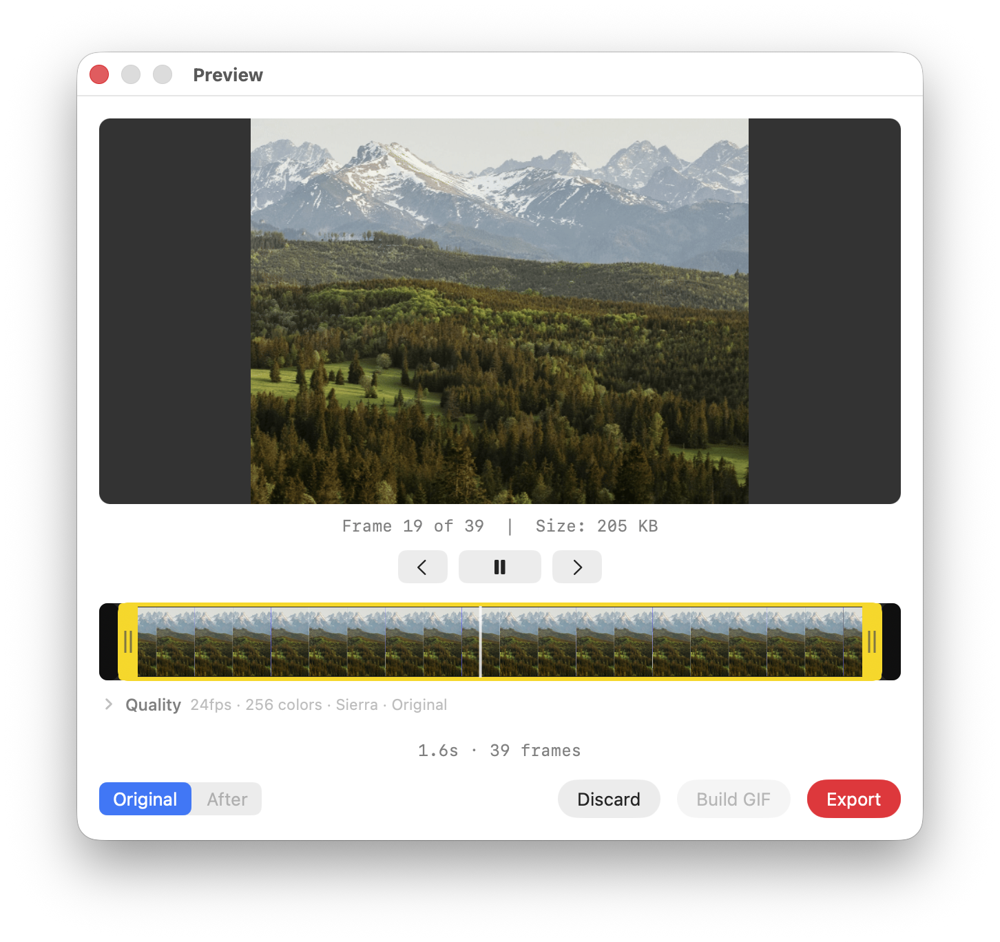
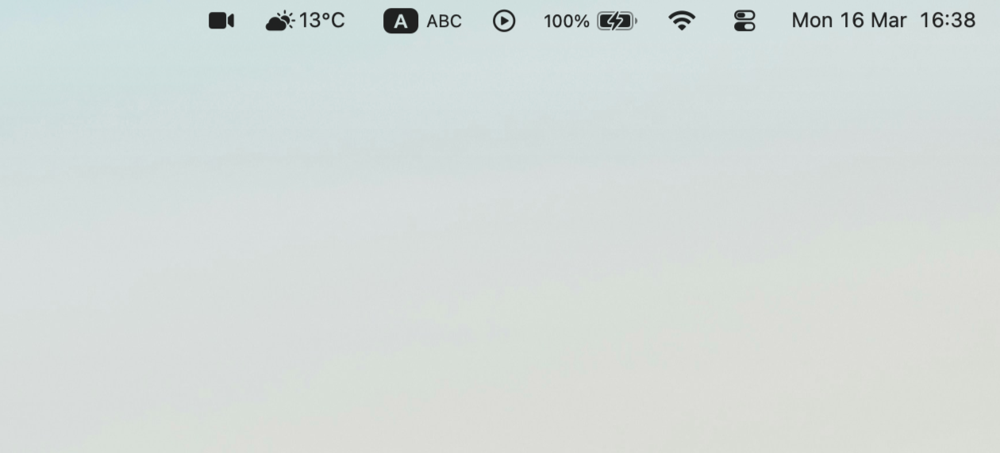
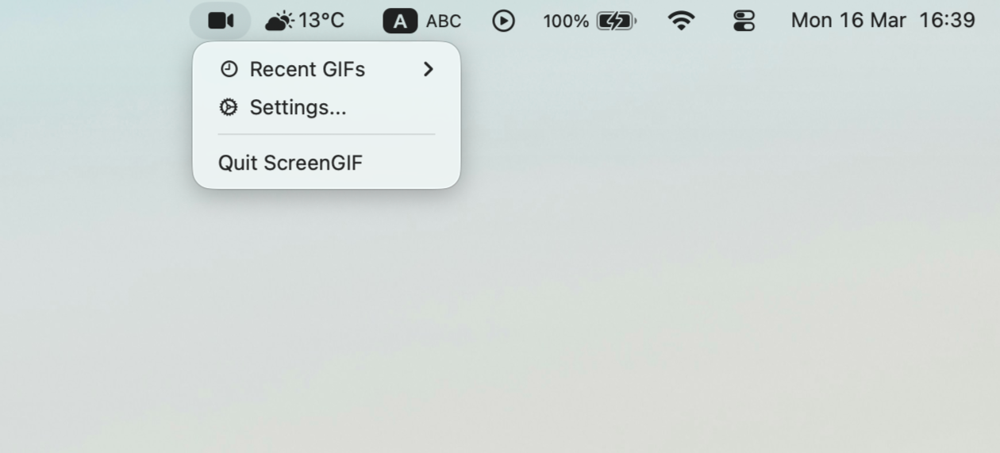
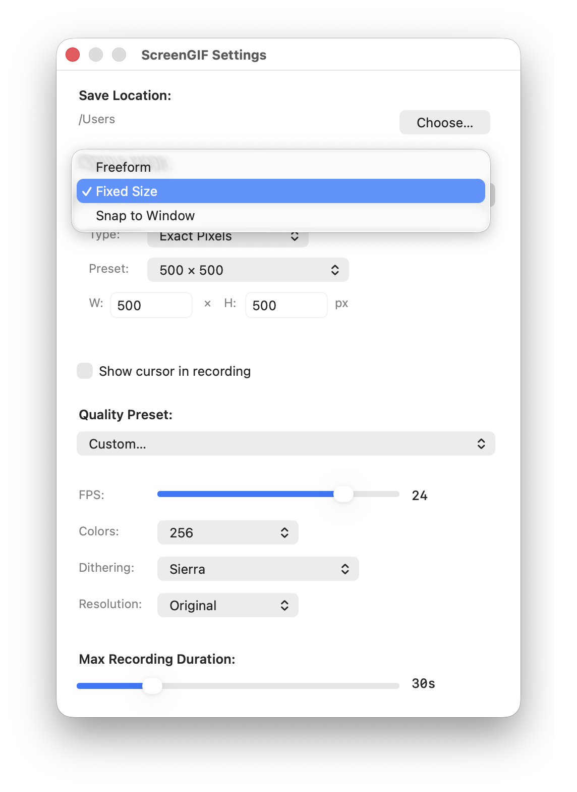
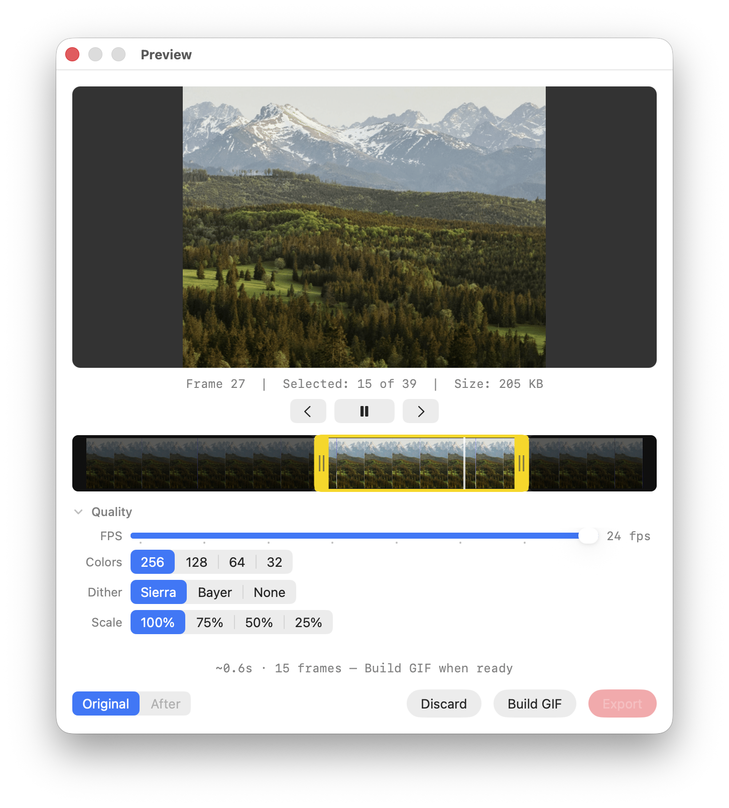
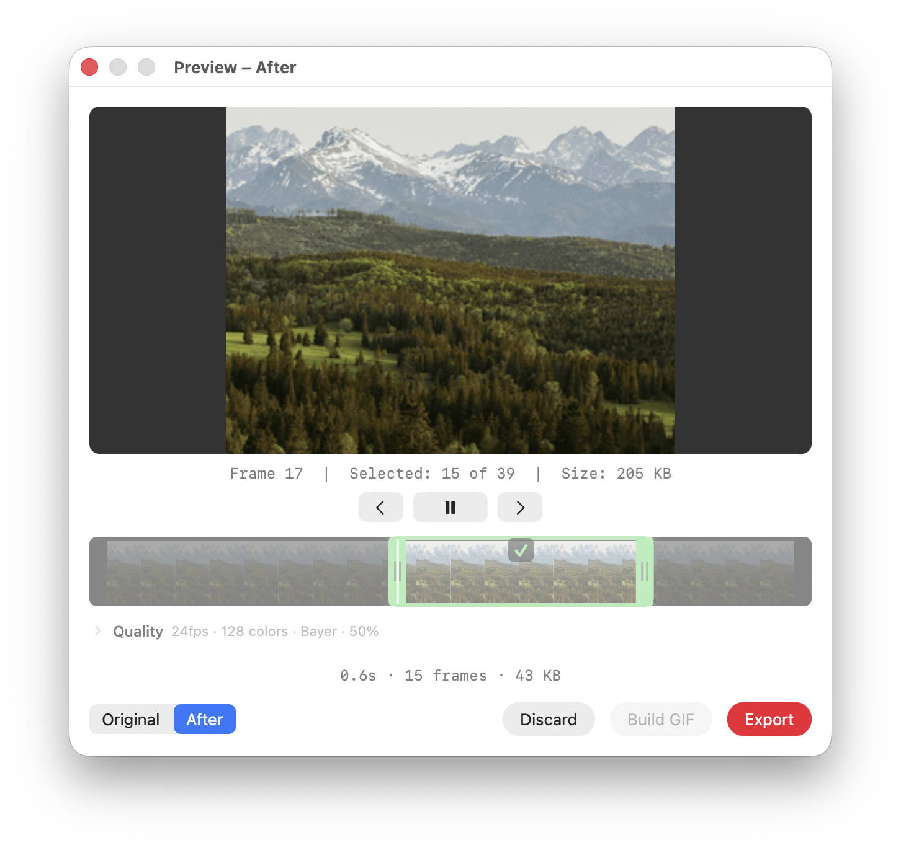

# ScreenGIF for macOS

Lightweight macOS menu bar app for recording part of your screen and exporting animated GIFs.



---

## A little note from me :D

Hi, I'm Samittra.

I do design / technical stuff lately, mostly around finance and animation / VFX.
I made this for myself first to be honest, then thought maybe I should just leave it here too in case it helps somebody.

I do a lot of tutorials and docs for my students, and static screenshots were just not enough sometimes.
So I made this over a couple of weekends in Swift because I use Mac anyway lol.

Sorry if it feels a bit awkward here and there.
I do want to pay 99$ as Apple Dev member properly later, but for now I would rather keep that money for my new monitor first.

If you catch a bug in my app, please tell me directly:

- `samitt.watt@gmail.com`

Hope it helps. :D

---

## Before You Start

ScreenGIF needs one extra tool before it can create GIF files:

- **Homebrew**: a trusted app installer for macOS
- **ffmpeg**: the tool ScreenGIF uses to build the final GIF

If you have never heard of either of these, that is completely fine.
You do not need to install them by hand if you do not want to.

Use this file first:

- `ffmpeg_setup.command`

What it does:

1. Checks whether Homebrew is already installed
2. Checks whether ffmpeg is already installed
3. Asks before installing anything
4. Can open the official Homebrew website if you want to read about it first
5. May ask for your Mac administrator password during installation

That password prompt is normal when installing software on macOS.

---

## Current Release

- Version: `1.0.0`
- DMG asset: `ScreenGIF-1.0.0.dmg`

---

## Requirements

- macOS 13.0 (Ventura) or later
- `ffmpeg` installed on your Mac

If you prefer to install things yourself, you can:

- visit the official Homebrew website: [brew.sh](https://brew.sh/)
- then install ffmpeg in Terminal with:

  ```bash
  brew install ffmpeg
  ```

---

## Install

### Step 1: Install ffmpeg

1. In this folder, double-click `ffmpeg_setup.command`
2. A Terminal window will open
3. Follow the questions on screen
4. If Homebrew or ffmpeg is missing, the setup helper can install them for you
5. When setup is finished, you can leave Terminal

### Step 2: Install ScreenGIF

1. Open `ScreenGIF-1.0.0.dmg`
2. Drag **ScreenGIF.app** into **Applications**
3. Eject the DMG

Before opening the app for the first time, make sure `ffmpeg` is installed.
If needed, run `ffmpeg_setup.command` first.

Because this build is not Apple-signed or notarized yet, macOS may block the first launch.

If that happens:

1. Open **Applications**
2. **Right-click** `ScreenGIF.app`
3. Click **Open**
4. Click **Open** again in the confirmation dialog

If macOS still blocks it:

- Open **System Settings > Privacy & Security**
- Scroll down
- Click **Open Anyway**

---

## First Launch

### Step 3: Allow Screen Recording

When you open ScreenGIF for the first time, macOS will ask for **Screen Recording** permission.

1. Open the privacy settings when prompted
2. Enable ScreenGIF in **System Settings > Privacy & Security > Screen Recording**
3. Quit and relaunch the app

After that, ScreenGIF is ready to use.

---

## Main Features

- Menu bar screen recording workflow
- Freeform, Fixed Size, Aspect Ratio, and Snap to Window capture modes
- Floating click-to-stop recording pill
- GIF preview window with trim filmstrip
- Quality controls for FPS, colors, dithering, and resolution
- Original / After workflow for comparing source and built GIFs
- Export flow with recent GIF history

---

## How to use

If this is your first time opening it, here is the short version:

- **Left click** the menu bar icon to start a new recording
- **Right click** the menu bar icon to open settings, recent GIFs, or quit
- After recording, you will get a preview window where you can trim and export

### 1. Start a recording

Left click the ScreenGIF icon in your menu bar.



The screen will dim a bit and wait for you to choose an area.

What you can do here:

- click and drag to choose the part of the screen you want
- press `ESC` if you want to cancel and go back out

After you choose the area, recording starts.

To stop recording:

- click the menu bar icon again
- or click the floating recording pill

That is the basic recording loop.

### 2. Open settings if you want to change how it records

Right click the menu bar icon.



Then open **Settings...**



This is where you can choose things like:

- capture mode: Freeform, Fixed Size, or Snap to Window
- whether the cursor should be visible
- GIF quality settings such as FPS, colours, dithering, and size
- max recording duration

If you do not want to touch any of this yet, that is completely okay. The app will still work with the current settings.

### 3. Check your recording in the preview window

After you stop recording, ScreenGIF opens the preview window.



This is the part that can feel a tiny bit confusing at first, so here is the easy version:

- the big image at the top is your preview
- the strip of small images underneath is the timeline
- the yellow handles let you choose where the GIF should start and end
- the quality controls let you change how heavy or light the GIF should be

If you do not want to adjust much, you can just trim a little, click **Build GIF**, then **Export**.

### 4. Understand `Original` and `After`

ScreenGIF has 2 views:

- **Original** = the recording you just made, before building the final GIF
- **After** = the built GIF with your current trim and quality settings applied

In **Original**:

- you can move the trim handles
- you can change the quality settings
- you can click **Build GIF** when you are ready

So basically:

- **Original** is the place where you adjust things
- **After** is the place where you check the final result

After you click **Build GIF**, ScreenGIF prepares the final version and shows it in **After**.



In **After**:

- you can review what the final GIF really looks like
- you can compare it with the original
- if it looks good, click **Export**
- if not, go back to **Original**, adjust things, and build again

### 5. Export your GIF

When you are happy with the result:

1. Click **Export**
2. Choose where you want to save the file
3. ScreenGIF will save the final GIF there

If you do not want to keep the recording, click **Discard** instead.

### Small tip if you want the easiest way

If you just want the easiest path without playing with too many settings:

1. Left click the menu bar icon
2. Record a small area
3. Stop recording
4. Trim if needed
5. Click **Build GIF**
6. Click **Export**

That is enough for most quick GIFs.


---

## Known Limitations

- This build is ad-hoc signed only, not notarized
- `ffmpeg` is required and is not bundled inside the app
- Multi-monitor vertical-layout edge cases have not been fully tested yet

---

## Included In This Folder

- `ScreenGIF-1.0.0.dmg`
- `ffmpeg_setup.command`
- `RELEASE_NOTES_1.0.0.md`
- `LICENSE`

---

## License

See [LICENSE](LICENSE).
